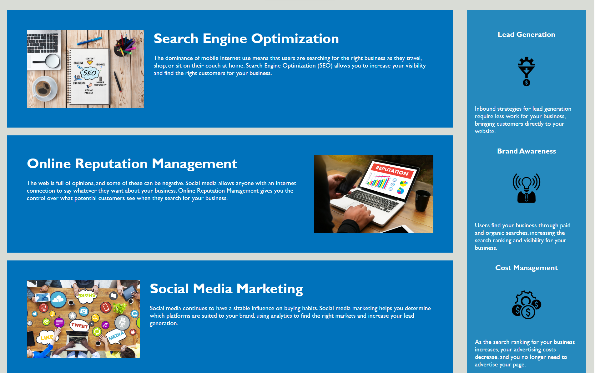

# Code Refactor Starter Code
***
## Overview

Hi there ✋!

The purpose of this project is to provide the client, Horiseon Marketing, with an refactored webpage code that will promote the site's SEO. The code needed to be streamlined; and it needed to be accessible. Semantics that did not promote accesibility were removed and replaced with accessible semantics, as listed on: https://developer.mozilla.org/en-US/docs/Learn/Accessibility/HTML. 

Code redudancies were removed and streamlined, while retaining the look and feel of the original webpage design. While increasing this site's accessibility could be done in inumerable ways, the changes that were made will improve search engine optimization and the sites overall accessibility. 

## Installation

NA

## Usage
A refractored code, used to update the sites' accessibility and improve the SEO can be viewed as follows:

## Credits

"N/A"

## License

MIT License

## Features

### This project includes:
1. Header links that jump the reader to another section of the homepage.
2. Alt text for header links.
3. Alt text for images.

